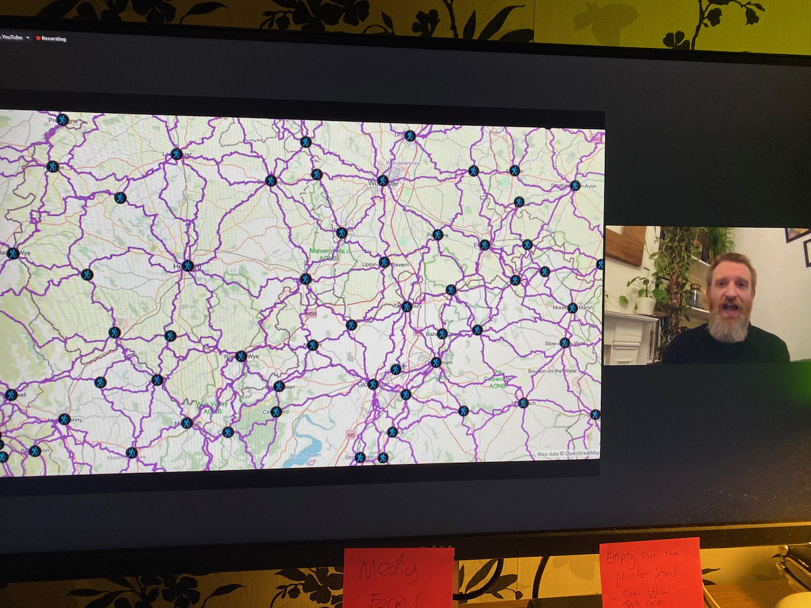
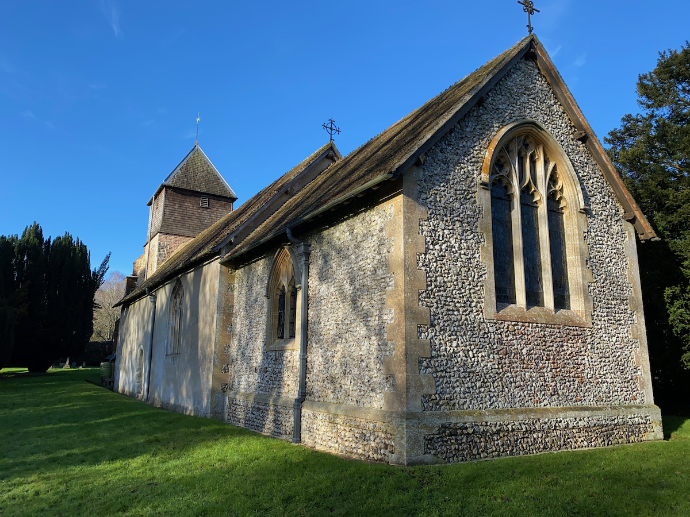
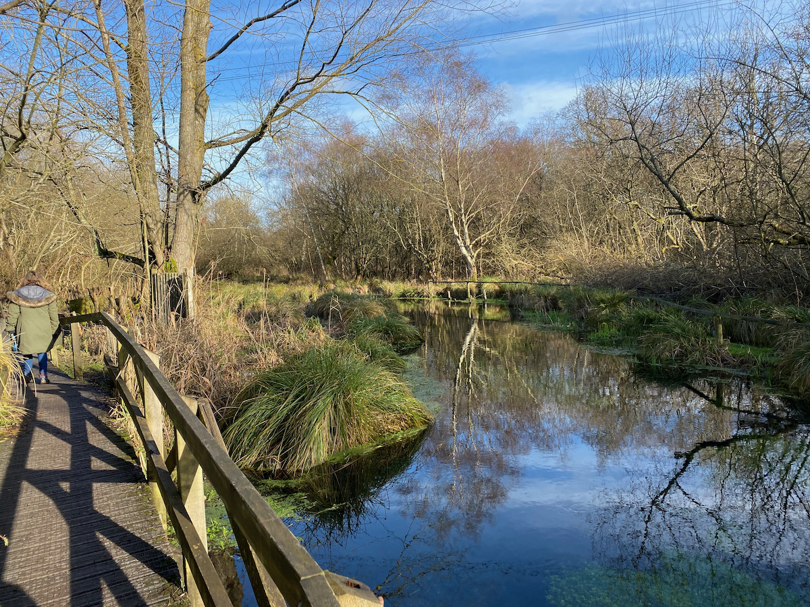
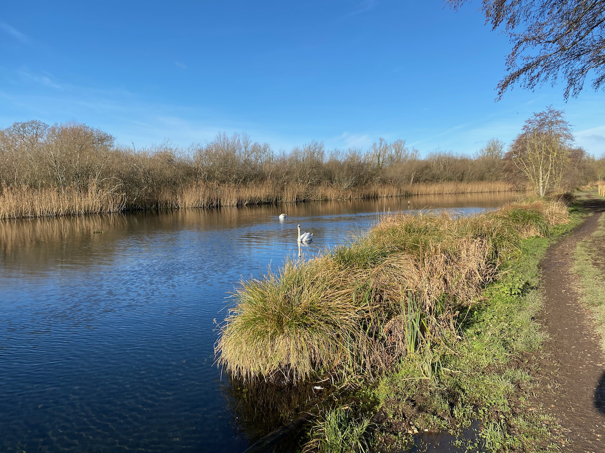
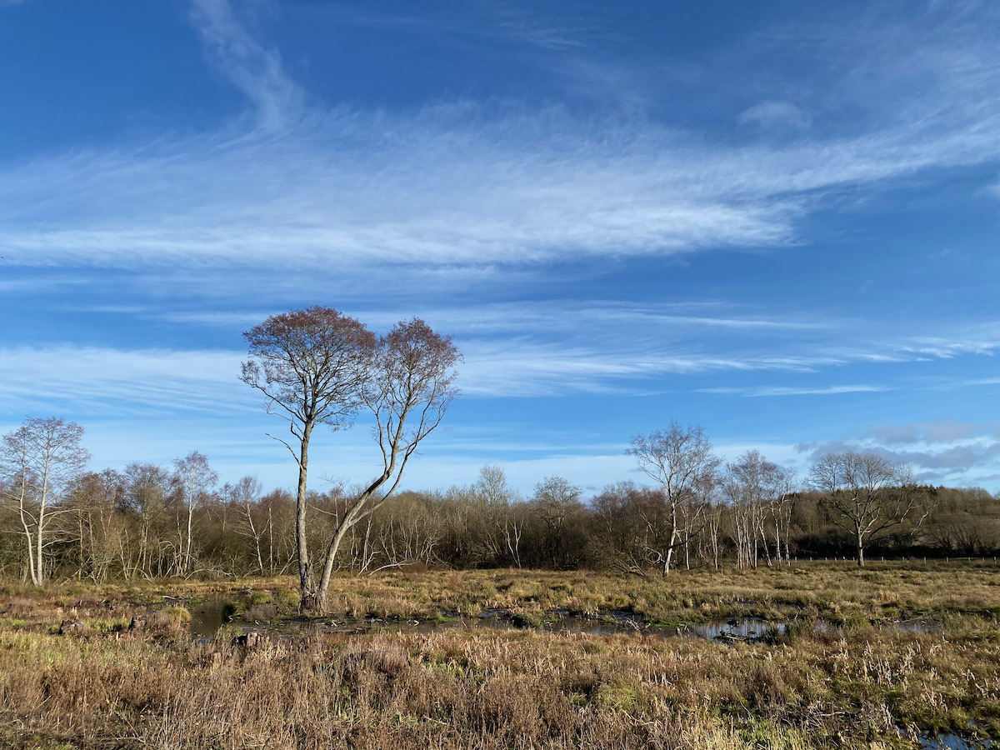

We have been out for short walks this week but today our walk was a bit longer. The lockdown limits what we can and can't do

## Slow Ways on Tuesday evening

On Tuesday night I tuned in to the Slow Ways webinar presented by founder Dan Raven-Ellison. It was fascinating to learn more about this ambitious project. It is delayed for the time being for obvious reasons but you can stay up to date via:

- [Twitter](https://twitter.com/slowwaysuk)
- [Official Website](https://slowways.org)

## Army Golf Course

During the current lockdown, we have been looking for places to take walks that aren't too busy. One of these places is the Army Golf Course in between Farnborough and Aldershot. It isn't open to the public but there are some paths that cut through it. It is very sceni and I've captured some really nice photos around it's edge with both my iPhone and big camera over the years. So quiet there, it's lovely. Mind you it's quiet everywhere right now.

## Greywell walk
Found this great walk on Alltrails.com which I referred to in one of my recent [notes](/notes/2021-01-16-explore-greywell-and-mapledurwell-or-alltrails/) and this is a location we wanted to explore once again. 

The church is St Mary and you can find out more about it at [northhampshirechurches.org.uk](http://www.northhampshirechurches.org.uk/northhampshirechurches/st_mary_greywell-16214.aspx). Just behind the church is a path that leads to the Whitewater river and a boardwalk that follows it's banks linking to [Greywell Mill](https://historicengland.org.uk/listing/the-list/list-entry/1092309).

[Greywell Moors Nature Reserve](https://www.hiwwt.org.uk/nature-reserves/greywell-moors-nature-reserve) is just behind the Mill and an area of real interest. I have made a note to go back there once the lockdown has passed with the full camera kit. 

