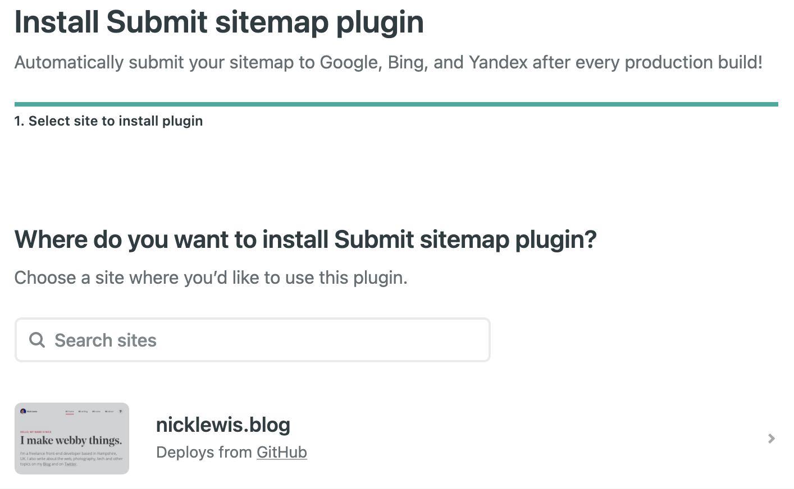
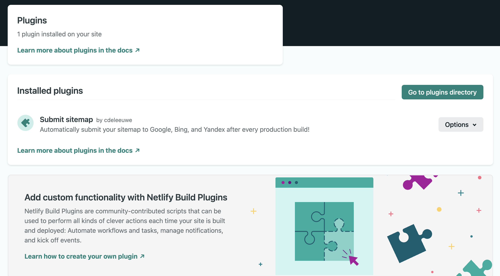

Netlify have recently been working hard on their Build Plugins. What are they exactly? They are workflow tools that add an extra layer of functionality on top of the general CI/CD pipeline infrastructure. They add extra automation to your web app builds that can be very beneficial to your projects and clients alike.

Suppose you are generating a sitemap on each build, if your site is built on Eleventy like this one, you will find the sitemap template at `src/sitemap.njk` which may look something like:


```
<?xml version="1.0" encoding="UTF-8"?>
<urlset xmlns="http://www.sitemaps.org/schemas/sitemap/0.9">

    
    <url>
        <loc>{{ site.url }}{{ item.url | url | absoluteUrl(meta.url) }}</loc>
        <lastmod>{{ item.date | dateToFormat('yyyy-MM-dd') }}</lastmod>
        <changefreq>{{ item.data.changeFreq if item.data.changeFreq else "monthly" }}</changefreq>
    </url>
    

</urlset>
```


The output goes into ``sitemap.xml`` which we need to publish to Google when pushing changes to Netlify. In fact whilst publishing this brief how-to, it will have run this plugin!

## How to submit your sitemap to Google

To do so, just click on the link below, it will log you into your Netlify account, so long as you have one of course! If not - get one today ;-)

[Add the plugin](https://app.netlify.com/plugins/netlify-plugin-submit-sitemap/install?utm_source=hs_email&utm_medium=email&utm_campaign=General%20Newsletter&_ga=2.194941549.1312861749.1611783116-2097385266.1608587924)

Select your site to add the plugin to



That is it - we can check that our plugins are active via the panel below, which you'll be redirected to automatically.



[Check it out on Github](https://github.com/cdeleeuwe/netlify-plugin-submit-sitemap#readme)

Now it will be a case of deploying an update to your site so that it rebuilds and triggers the Google submission.
