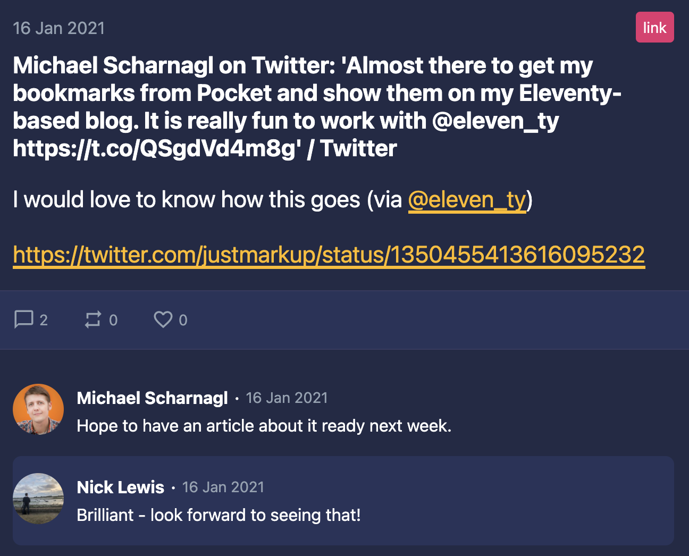

Having decided recently to create my first Eleventy website, I have become rather fascinated or perhaps (to be honest) excitedly obsessed with the whole idea of the Indieweb. It's like I've gone back to the 90's when I was a fresh faced 20 year old and the web was young... and innocent too.

I will write more about the [Indieweb](https://indieweb.org/) soon and if you aren't familiar with it, it is worth looking up. In terms of sharing, the general idea is to follow the [POSSE](https://indieweb.org/POSSE) principle. That is to <strong>P</strong>ublish (on your) <strong>O</strong>wn <strong>S</strong>ite, <strong>S</strong>yndicate <strong>E</strong>lsewhere, the practice of posting content on your own site first, then publishing copies or sharing links to third parties (like social media silos) with original [permalinks](https://indieweb.org/permalink#:~:text=A%20permalink%20is%20a%20URL,explicitly%20called%20a%20post%20permalink).) to provide viewers a path to directly interact with your content.

This site is divided up into ["blog"](/blog) and ["notes"](/notes) the former being for longer form writing like this post and the latter for shorter material, designed to resemble Tweets or other microblog formats. All content is written using Markdown, files are committed to our repository on GitHub.

Every time the remote repository is updated, the following things happen:

* a webhook is fired to trigger a deployment on Netlify
* the site is rebuilt, then
* a serverless function is fired to process the notes
* if a note is flagged to be syndicated to Twitter and hasn't yet been published there
* we push the note out via the Twitter API as a new tweet

The outcome of this is that you'll see a new Tweet if you [follow me there](https://twitter.com/nicklewis) linking back to my note here on the website.

I have also setup another cool thing using Github actions to trigger a Netlify deployment at midnight every day. A bit like Cron, in fact that's what it is and is quite a special feature. The reason for doing this is that the site makes use of [webmentions](https://alistapart.com/article/webmentions-enabling-better-communication-on-the-internet/). I have a script setup on Netlify that is triggered upon a successful deploy. It makes a call to [webmention.io](https://webmention.io) and it's API. It retrieves a JSON response detailing where my content has been liked, replied to or retweeted. This data is then used when rendering the site to add the extra conversational output taken from the Twittersphere!

However suppose I wanted to share a piece of content from my browser that I'd come across and wanted to mention it in my notes such as [this note about the photographer Soren Solkaer](/notes/2021-01-15-soren-solkaer/) there is a way I can do this without needing a text editor and writing any code. 

I could do something like this:

* Create a bookmarklet which I can drop into my bookmarks bar
* That launches a modal pop-up form prepopulated with link and title
* I can then write my comments and click on publish
* A lambda function is fired via Netlify which posts my "note" to my Github account
* This fires a rebuild and consequently cross-posts a Tweet
* The Notes page and sub-content is updated there and then

Wow! Boom! Mind blown etc. It sounds technical and it is a bit but it goes to show that there are snazzy ways of making it almost as spontaneous as it is to just send a tweet the normal way!!